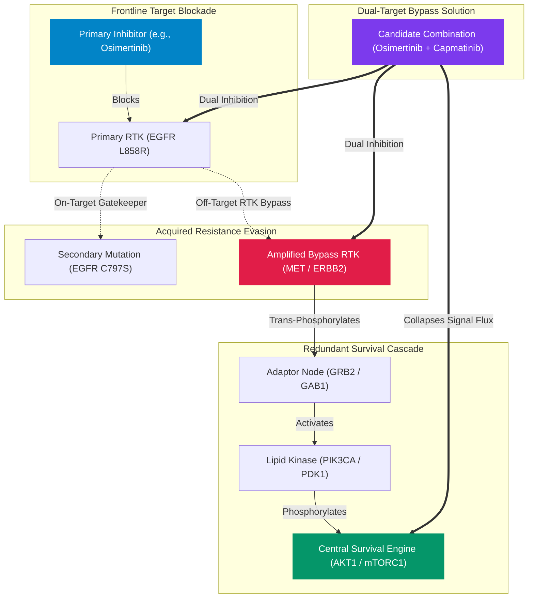

# 🔬 Targeted Oncology Resistance Bypass Engine

<div align="center">

# **Targeted Oncology Resistance Bypass Engine**
### **A Computational Graph Engine for Modeling Acquired Drug Resistance & Resolving Dual-Target Combination Therapies in Human Malignancies**

[](https://resistance-bypass-engine.vercel.app/)
[](https://github.com/realrezi/Resistance-Bypass-Engine)
[](LICENSE)
[](https://www.python.org/)
[](https://fastapi.tiangolo.com/)

**Author:** [Ahmadreza Shirdel](https://github.com/realrezi)

</div>

---

## 🎯 Overview

When patients with advanced solid tumors or hematologic malignancies undergo treatment with targeted small-molecule inhibitors (e.g., Osimertinib, Alectinib, Sotorasib, Dabrafenib), cancer cells rapidly evolve secondary resistance. These resistance mechanisms broadly fall into two biological categories:

1. **On-Target Gatekeeper & ATP Pocket Mutations:** Mutations within the drug-binding domain (e.g., *EGFR* C797S, *ABL1* T315I, *ALK* G1202R) that disrupt drug binding.
2. **Off-Target RTK Bypass Hyperactivation:** Alternative receptor tyrosine kinase signaling pathways (e.g., *MET* gene amplification, *HER2* overexpression, *PIK3CA* mutations) that bypass frontline inhibition and sustain cell survival.

The **Targeted Oncology Resistance Bypass Engine** models these complex signaling networks using `NetworkX`, extracts Largest Connected Components ($G_{\text{LCC}}$), computes **Hub-Penalized Bottleneck Centrality**, and ranks active, non-withdrawn clinical combination therapies.

---

## 🧬 Biological Network & Signaling Topology



---

## 📐 Mathematical Formulation

### 1. Graph Topology & Connected Component Extraction

Given a target gene $s$ and secondary resistance marker $t$, the system queries the STRING-DB physical interaction network ($w \ge 0.400$) to construct an undirected graph $G = (V, E, W)$. The engine isolates the Largest Connected Component ($G_{\text{LCC}}$):

$$G_{\text{LCC}} = \arg\max_{C \subseteq G} |V(C)| \quad \text{subject to } |V(G_{\text{LCC}})| \ge 2$$

---

### 2. Hub-Penalized Bottleneck Centrality

To prevent non-specific promiscuous super-hubs (e.g., Ubiquitin, P53) from skewing network calculations, raw betweenness centrality $C_B(v)$ is adjusted using a degree logarithmic penalty:

$$C_{\text{target}}(v) = \frac{C_B(v) + 0.5 \times \frac{\text{degree}(v)}{\Delta(G_{\text{LCC}})}}{\log_2(\text{degree}(v) + 2)}$$

where $\Delta(G_{\text{LCC}}) = \max_{u \in V} \text{degree}(u)$ denotes the maximum node degree in the connected component.

---

### 3. Combination Synergy Score ($S$)

Combination candidate therapies targeting secondary node $v$ are evaluated using a multi-objective scoring formula:

$$\text{Synergy Score } (S) = \alpha \cdot C_{\text{norm}}(v) + \beta \cdot (1.0 - d_{\text{norm}}(s, v)) + \gamma \cdot \text{Aff}_{\text{norm}}(v)$$

- $\alpha = 0.40, \beta = 0.30, \gamma = 0.30$ (when binding affinity $p\text{ChEMBL}$ is available)
- $\alpha = 0.55, \beta = 0.45, \gamma = 0.00$ (when binding affinity is pending)

---

## 📊 Prevalent Clinical Resistance Matrix

| Tumor Indication | Primary Driver | Frontline Agent | Secondary Bypass Marker | Literature Prevalence | Mechanism of Action |
| :--- | :--- | :--- | :--- | :--- | :--- |
| **NSCLC (Lung)** | `EGFR L858R` | Osimertinib | `MET Amplification` | **15–20% Acquired** | Off-Target RTK Bypass via ERBB3/PI3K |
| **NSCLC (Lung)** | `EGFR L858R` | Osimertinib | `EGFR C797S` | **7–10% Gatekeeper** | On-Target Covalent Binding Disruption |
| **NSCLC (Lung)** | `EML4-ALK` | Alectinib | `MET Bypass` | **8–12% Bypass** | Parallel RTK Activation in ALK+ NSCLC |
| **HER2+ Breast** | `ERBB2 / HER2` | Trastuzumab | `MET Amplification` | **10–15% RTK Bypass** | Monoclonal Antibody Bypass Evasion |
| **HR+ Breast** | `ESR1` | Fulvestrant | `CDK4 / Cyclin D1` | **25–40% Post-Aromatase Inhibitors (AI)** | Endocrine Escape post-Aromatase Inhibitor failure via Cell Cycle Activation |

| **Colorectal (CRC)** | `KRAS G12C` | Sotorasib | `EGFR Feedback` | **70–85% Feedback** | Rapid RTK Feedback Reactivation |
| **Colorectal (CRC)** | `BRAF V600E` | Encorafenib | `EGFR Feedback` | **75–85% Feedback** | Monotherapy BRAF Escape Loop |
| **Melanoma** | `BRAF V600E` | Dabrafenib | `MAP2K1 / MEK1` | **35–45% Acquired** | MAPK Cascade Re-activation |
| **CML / AML** | `BCR-ABL1` | Imatinib | `ABL1 T315I` | **15–20% Gatekeeper** | Gatekeeper Steric Binding Loss |
| **Prostate (mCRPC)** | `AR` | Enzalutamide | `PIK3CA / PTEN` | **40–50% PTEN/PI3K** | Reciprocal AR-PI3K Feedback Crosstalk |
| **Ovarian / GYN** | `PIK3CA` | Alpelisib | `KRAS` | **15–25% Co-mutation** | Parallel RAS/MAPK Activation |
| **Glioma (GBM)** | `EGFRvIII` | Gefitinib | `MET` | **10–15% Redundancy** | Co-activation of Multiple RTKs |
| **Thyroid** | `RET Fusion` | Selpercatinib | `MET` | **10–15% Acquired** | MET Bypass emerging after RET TKI |


---

## 💻 Tech Stack & Architecture

- **Backend Framework:** Python 3.11+, FastAPI, Uvicorn, Pydantic v2
- **Graph Computations:** NetworkX, SciPy, NumPy
- **Network I/O & Concurrency:** `asyncio.Semaphore(5)`, `httpx`, `tenacity` exponential backoff
- **Caching & Persistence:** `diskcache` (7-day TTL, 1GB storage limit)
- **Frontend Workstation:** Vanilla CSS (Glassmorphism), Cytoscape.js, 3Dmol.js (Macromolecular PDB viewer)

---

## 🛠️ Installation & Local Setup

```bash
# 1. Clone Repository
git clone https://github.com/realrezi/Resistance-Bypass-Engine.git
cd Resistance-Bypass-Engine

# 2. Initialize Environment via uv
uv venv
source .venv/bin/activate

# 3. Install Dependencies
uv pip install -e .

# 4. Run Test Suite
uv run pytest -v

# 5. Launch Clinical Workstation
uv run uvicorn src.main:app --reload --port 8000
```

---

## 📄 License & Attribution

Distributed under the **MIT License**. See [`LICENSE`](LICENSE) for details.

**Author:** [Ahmadreza Shirdel](https://github.com/realrezi)  
**Repository:** [https://github.com/realrezi/Resistance-Bypass-Engine](https://github.com/realrezi/Resistance-Bypass-Engine)
