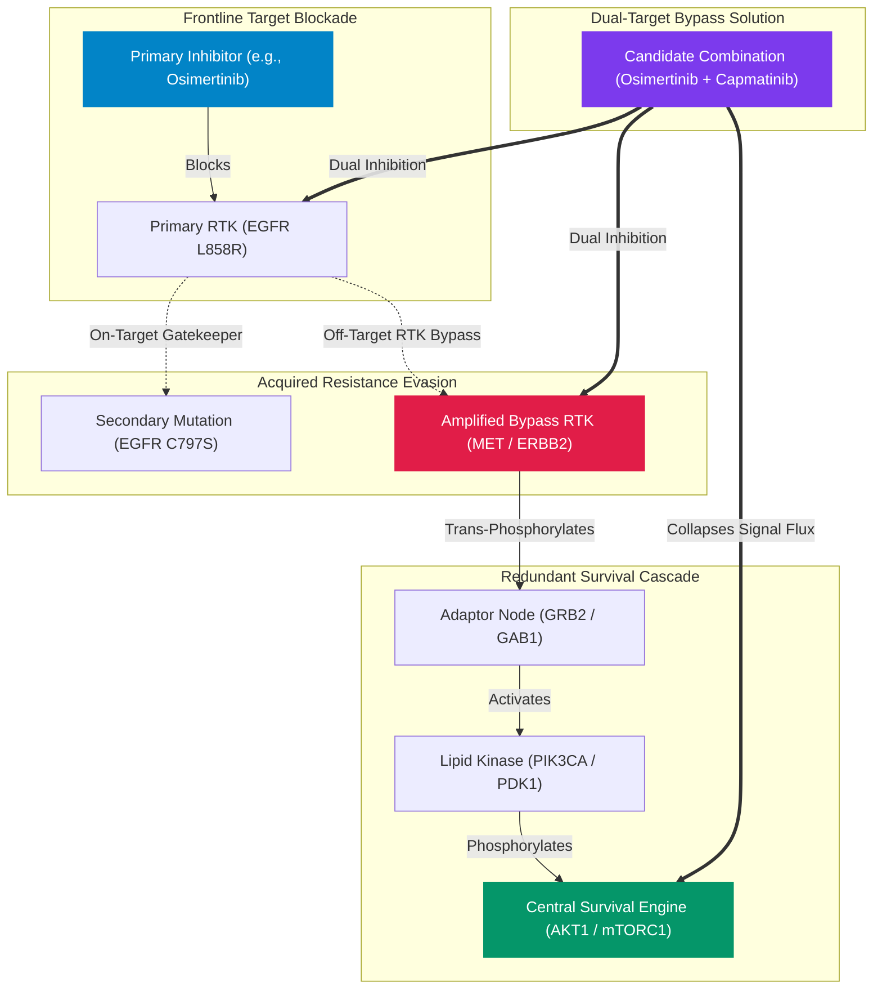

# Targeted Oncology Resistance Bypass Engine

**A Computational Graph Engine for Modeling Acquired Drug Resistance & Resolving Dual-Target Combination Therapies in Human Malignancies**

[](https://resistance-bypass-engine.vercel.app/)
[](https://github.com/realrezi/Resistance-Bypass-Engine)
[](LICENSE)
[](https://www.python.org/)
[](https://fastapi.tiangolo.com/)

**Author:** [Ahmadreza Shirdel](https://github.com/realrezi)

---

## 🎯 Overview

When patients with advanced solid tumors or hematologic malignancies undergo treatment with targeted small-molecule inhibitors (e.g., Osimertinib, Alectinib, Sotorasib, Dabrafenib), cancer cells rapidly evolve secondary resistance. These resistance mechanisms broadly fall into two biological categories:

1. **On-Target Gatekeeper & ATP Pocket Mutations:** Mutations within the drug-binding domain (e.g., *EGFR* C797S, *ABL1* T315I, *ALK* G1202R) that disrupt drug binding.
2. **Off-Target RTK Bypass Hyperactivation:** Alternative receptor tyrosine kinase signaling pathways (e.g., *MET* gene amplification, *HER2* overexpression, *PIK3CA* mutations) that bypass frontline inhibition and sustain cell survival.

The **Targeted Oncology Resistance Bypass Engine** models these complex signaling networks using `NetworkX`, extracts Largest Connected Components ($G_{\text{LCC}}$), computes **Hub-Penalized Bottleneck Centrality**, and ranks active, non-withdrawn clinical combination therapies.

The output is research-use evidence prioritization, not proof of combination efficacy or a patient-specific treatment recommendation. Reports retain the legacy `synergy_score` field for compatibility, but it represents a computational priority value rather than experimental synergy.

### Evidence and uncertainty

Each report now includes additive `evidence_claims` records with source, retrieval date, evidence level, review state, limitations, and unresolved questions. Structured request fields distinguish mutations, amplifications, deletions, fusions, expression changes, splice variants, and pathway activation. When upstream clinical evidence is absent, the service returns an explicit warning and an empty candidate list instead of inventing a drug identity.

Reports also include reproducibility metadata: a generation timestamp, methodology version, source set, and a stable request fingerprint that does not contain patient identifiers.

---

## 🧬 Biological Network & Signaling Topology



---

## 📐 Mathematical Formulation

### 1. Graph Topology & Connected Component Extraction

Given a target gene $s$ and secondary resistance marker $t$, the system queries the STRING-DB physical interaction network ($w \ge 0.400$) to construct an undirected graph $G = (V, E, W)$. The engine isolates the Largest Connected Component ($G_{\text{LCC}}$):

$$G_{\text{LCC}} = \arg\max_{C \subseteq G} |V(C)| \quad \text{subject to } |V(G_{\text{LCC}})| \ge 2$$

---

### 2. Hub-Penalized Bottleneck Centrality

To prevent non-specific promiscuous super-hubs (e.g., Ubiquitin, P53) from skewing network calculations, raw betweenness centrality $C_B(v)$ is adjusted using a degree logarithmic penalty:

$$C_{\text{target}}(v) = \frac{C_B(v) + 0.5 \times \frac{\text{degree}(v)}{\Delta(G_{\text{LCC}})}}{\log_2(\text{degree}(v) + 2)}$$

where $\Delta(G_{\text{LCC}}) = \max_{u \in V} \text{degree}(u)$ denotes the maximum node degree in the connected component.

---

### 3. Heuristic Combination Priority Score ($P$)

Candidate therapies targeting secondary node $v$ are ranked using a computational prioritization formula. This is not an experimental synergy measurement and does not establish clinical benefit:

$$\text{Priority Score } (P) = \alpha \cdot C_{\text{norm}}(v) + \beta \cdot (1.0 - d_{\text{norm}}(s, v)) + \gamma \cdot \text{Aff}_{\text{norm}}(v)$$

- $\alpha = 0.40, \beta = 0.30, \gamma = 0.30$ (when binding affinity $p\text{ChEMBL}$ is available)
- If binding affinity is missing, the available topology and proximity weights are renormalized; missing pharmacology contributes no positive evidence.

The legacy `synergy_score` response field is retained for compatibility, but it should be interpreted as this heuristic priority value. It is not Bliss, Loewe, HSA, ZIP, or another experimental synergy metric.

The implementation uses fixed transforms rather than candidate-pool min–max normalization: topology is `1 - exp(-4x)`, proximity is `exp(-distance)`, and pharmacology uses a logistic transform centered at pChEMBL 7. Adding another candidate therefore does not change an existing candidate's score.

---

## 📊 Clinical Resistance Scenario Matrix

| Tumor Indication | Primary Driver | Frontline Agent | Secondary Bypass Marker | Literature Prevalence | Mechanism of Action |
| :--- | :--- | :--- | :--- | :--- | :--- |
| **NSCLC (Lung)** | `EGFR L858R` | Osimertinib | `MET Amplification` | **Frequency varies by cohort, line, and assay** | Off-Target RTK Bypass via ERBB3/PI3K |
| **NSCLC (Lung)** | `EGFR L858R` | Osimertinib | `EGFR C797S` | **Frequency varies by treatment line and assay** | On-Target Covalent Binding Disruption |
| **NSCLC (Lung)** | `EML4-ALK` | Alectinib | `MET Bypass` | **Frequency varies by cohort** | Parallel RTK Activation in ALK+ NSCLC |
| **HER2+ Breast** | `ERBB2 / HER2` | Trastuzumab | `MET Amplification` | **Context-specific RTK bypass frequency** | Monoclonal Antibody Bypass Evasion |
| **HR+ Breast** | `ESR1` | Fulvestrant | `CDK4 / Cyclin D1` | **Frequency varies after aromatase-inhibitor therapy** | Endocrine Escape post-Aromatase Inhibitor failure via Cell Cycle Activation |
| **Colorectal (CRC)** | `KRAS G12C` | Sotorasib | `EGFR Feedback` | **Context-specific; frequency varies by cohort** | Rapid RTK Feedback Reactivation |
| **Colorectal (CRC)** | `BRAF V600E` | Encorafenib | `EGFR Feedback` | **Mechanism documented; frequency varies by cohort** | Monotherapy BRAF Escape Loop |
| **Melanoma** | `BRAF V600E` | Dabrafenib | `MAP2K1 / MEK1` | **Acquired frequency varies by cohort** | MAPK Cascade Re-activation |
| **CML / AML** | `BCR-ABL1` | Imatinib | `ABL1 T315I` | **TKI-resistance frequency is context-specific** | Gatekeeper Steric Binding Loss |
| **Prostate (mCRPC)** | `AR` | Enzalutamide | `PIK3CA / PTEN` | **PTEN/PI3K alteration frequency varies by cohort** | Reciprocal AR-PI3K Feedback Crosstalk |
| **Ovarian / GYN** | `PIK3CA` | Alpelisib | `KRAS` | **Co-alteration frequency varies by cohort** | Parallel RAS/MAPK Activation |
| **Glioma (GBM)** | `EGFRvIII` | Gefitinib | `MET` | **RTK redundancy is context-specific** | Co-activation of Multiple RTKs |
| **Thyroid** | `RET Fusion` | Selpercatinib | `MET` | **Acquired bypass frequency varies by cohort** | MET Bypass emerging after RET TKI |

---

## 💻 Tech Stack & Architecture

- **Backend Framework:** Python 3.11+, FastAPI, Uvicorn, Pydantic v2
- **Graph Computations:** NetworkX, SciPy, NumPy
- **Network I/O & Concurrency:** pooled `httpx` keep-alive connections, `asyncio.Semaphore(5)`, `asyncio.gather`, `tenacity` exponential backoff
- **Caching & Persistence:** `diskcache` (7-day TTL, 1GB storage limit)
- **Frontend Workstation:** Vanilla CSS genomic-atlas UI, Cytoscape.js, 3Dmol.js (Macromolecular PDB viewer)

The analysis report includes a non-identifying trace ID, per-source timing, and any partial-source failures. `GET /api/v1/structure/{symbol}` exposes only curated local PDB mappings; unknown targets return an explicit unavailable state rather than fabricated UniProt, Ensembl, or PDB identifiers. Set `CHEMBL_ACTIVITY_MAX_PAGES` (default `2`) to control the bounded activity scan when latency matters. Independent live sources are queried concurrently and each is bounded by `LIVE_SOURCE_TIMEOUT_SECONDS` (default `15`); a timed-out provider is reported as partial evidence instead of blocking the full report.

Set `ALLOWED_ORIGINS` to a comma-separated allowlist in hosted environments. The default wildcard is intended only for local exploration and does not permit credentialed cross-origin requests.

---

## 🛠️ Installation & Local Setup

```bash
# 1. Clone Repository
git clone https://github.com/realrezi/Resistance-Bypass-Engine.git
cd Resistance-Bypass-Engine

# 2. Initialize Environment via uv
uv venv
source .venv/bin/activate

# 3. Install Dependencies
uv pip install -e .

# 4. Run Test Suite
uv run pytest -v

# 5. Launch Clinical Workstation
uv run uvicorn src.main:app --reload --port 8000
```

---

## 📄 License & Attribution

Distributed under the **MIT License**. See [`LICENSE`](LICENSE) for details.

**Author:** [Ahmadreza Shirdel](https://github.com/realrezi)  
**Repository:** [https://github.com/realrezi/Resistance-Bypass-Engine](https://github.com/realrezi/Resistance-Bypass-Engine)
