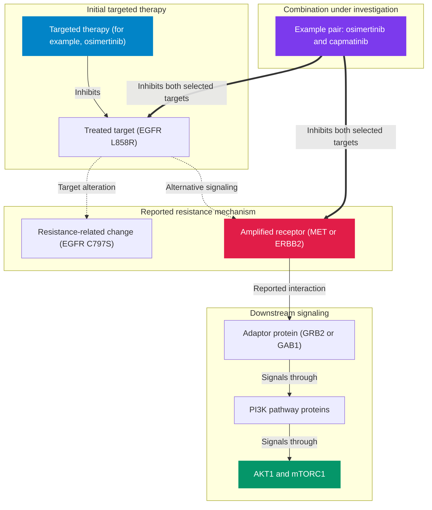

# Targeted Oncology Resistance Bypass Engine

**A research tool for exploring acquired resistance mechanisms and evidence for potential combination strategies in cancer.**

[](https://resistance-bypass-engine.vercel.app/)
[](https://github.com/realrezi/Resistance-Bypass-Engine)
[](LICENSE)
[](https://www.python.org/)
[](https://fastapi.tiangolo.com/)

**Author:** [Ahmadreza Shirdel](https://github.com/realrezi)

---

## Explore the workstation

- **Home** — a concise introduction to the evidence workflow
- **Analyze** — build a reproducible resistance report from a treatment target and resistance-associated gene
- **Scenarios** — open 19 reviewed examples across 11 cancer groups, including lung, breast, colorectal, prostate, ovarian, thyroid, GIST, and cholangiocarcinoma
- **Method** — inspect the graph calculations, ranking limits, and interpretation rules
- **Sources** — see what each live database contributes and what it cannot establish

Every built-in scenario remains usable during a temporary identifier-service outage through a small reviewed set of HGNC, Ensembl, UniProt, and ChEMBL identifiers. If an interaction or drug database is unavailable, the report identifies the missing source and avoids inventing a network path or clinical result.

---

## 🎯 Overview

Targeted therapies can select for acquired resistance. This project examines two broad patterns:

1. **A change in the treated target:** for example, *EGFR* C797S, *ABL1* T315I, or *ALK* G1202R may reduce inhibitor binding.
2. **Activation of another signaling pathway:** for example, *MET* amplification, *ERBB2* overexpression, or a *PIK3CA* alteration may support signaling despite inhibition of the original target.

The service confirms gene and protein records, retrieves reported protein interactions, gathers drug and disease records, and orders possible additional therapies for research review. The network calculations are implemented with `NetworkX` and are described below.

The output is research-use evidence prioritization, not proof of combination efficacy or a patient-specific treatment recommendation. Reports retain the legacy `synergy_score` field for compatibility, but it represents a computational priority value rather than experimental synergy.

### Evidence and report limits

Each report keeps the source, retrieval date, evidence level, review state, limitations, and unresolved questions visible. Request fields distinguish mutations, amplifications, deletions, fusions, expression changes, splice variants, and pathway activation. If the required clinical records are absent, the service reports the gap and returns no drug candidates instead of guessing.

Reports also include the generation time, method version, databases checked, and a reproducible report ID. The API field is named `request_fingerprint`; it is derived from the request and contains no patient identifier.

---

## 🧬 Protein interactions used in the analysis



---

## 📐 Technical method

### 1. Building a connected protein network

Given a treated target $s$ and resistance-related gene $t$, the service retrieves STRING protein interactions ($w \ge 0.400$) and builds an undirected graph $G = (V, E, W)$. It keeps the largest group of connected proteins, written as $G_{\text{LCC}}$, so distance calculations are not performed across disconnected groups:

$$G_{\text{LCC}} = \arg\max_{C \subseteq G} |V(C)| \quad \text{subject to } |V(G_{\text{LCC}})| \ge 2$$

---

### 2. Network position score (hub-penalized centrality)

This score estimates whether a protein lies on many short routes through the retrieved network. A logarithmic penalty reduces the influence of proteins that connect broadly and non-specifically. The calculation adjusts betweenness centrality $C_B(v)$ as follows:

$$C_{\text{target}}(v) = \frac{C_B(v) + 0.5 \times \frac{\text{degree}(v)}{\Delta(G_{\text{LCC}})}}{\log_2(\text{degree}(v) + 2)}$$

where $\Delta(G_{\text{LCC}}) = \max_{u \in V} \text{degree}(u)$ denotes the maximum node degree in the connected component.

---

### 3. Research priority score ($P$)

Possible additional therapies targeting protein $v$ are ordered using a research priority formula. It combines network position, distance from the treated target, and laboratory drug-activity data when available. It is not an experimental synergy measurement and does not establish clinical benefit:

$$\text{Priority Score } (P) = \alpha \cdot C_{\text{norm}}(v) + \beta \cdot (1.0 - d_{\text{norm}}(s, v)) + \gamma \cdot \text{Aff}_{\text{norm}}(v)$$

- $\alpha = 0.40, \beta = 0.30, \gamma = 0.30$ (when binding affinity $p\text{ChEMBL}$ is available)
- If binding affinity is missing, that component contributes no positive evidence; the remaining weights are not increased.

The legacy `synergy_score` response field is retained for compatibility, but it should be interpreted as this computational research priority. It is not Bliss, Loewe, HSA, ZIP, or another experimental synergy metric.

The implementation uses fixed transforms rather than scaling values within each candidate list: network position is `1 - exp(-4x)`, proximity is `exp(-distance)`, and drug activity uses a logistic transform centered at pChEMBL 7. Adding another candidate therefore does not change an existing candidate's score.

---

## 📊 Examples of reported resistance mechanisms

| Cancer type | Initial alteration | Targeted therapy | Resistance-related change | Evidence note | Proposed resistance mechanism |
| :--- | :--- | :--- | :--- | :--- | :--- |
| **NSCLC (Lung)** | `EGFR L858R` | Osimertinib | `MET Amplification` | **Reported after EGFR inhibition; confirm assay and treatment setting** | Alternative signaling through MET and ERBB3/PI3K |
| **NSCLC (Lung)** | `EGFR L858R` | Osimertinib | `EGFR C797S` | **Confirm the reported variant and previous EGFR inhibitor** | On-target covalent-binding disruption |
| **NSCLC (Lung)** | `EML4-ALK` | Alectinib | `MET Bypass` | **Confirm MET status and previous ALK therapy** | Parallel RTK activation in ALK-positive NSCLC |
| **HER2+ Breast** | `ERBB2 / HER2` | Trastuzumab | `MET Amplification` | **Reported in selected models and cohorts; confirm HER2 and MET status** | Alternative signaling through MET |
| **HR+ Breast** | `ESR1` | Fulvestrant | `CDK4 / Cyclin D1` | **Interpret in relation to previous endocrine therapy** | Ligand-independent ER signaling and cell-cycle activation |
| **Colorectal (CRC)** | `KRAS G12C` | Sotorasib | `EGFR Feedback` | **Confirm tumor type and previous KRAS G12C therapy** | Rapid RTK feedback reactivation |
| **Colorectal (CRC)** | `BRAF V600E` | Encorafenib | `EGFR Feedback` | **Mechanism documented; clinical use depends on the complete regimen** | EGFR-mediated return of MAPK signaling |
| **Melanoma** | `BRAF V600E` | Dabrafenib | `MAP2K1 / MEK1` | **Reported after MAPK-pathway therapy** | Return of MAPK signaling |
| **CML / Ph+ ALL** | `BCR-ABL1` | Imatinib | `ABL1 T315I` | **Interpret in relation to the previous TKI** | Drug-binding site change |
| **Prostate (mCRPC)** | `AR` | Enzalutamide | `PIK3CA / PTEN` | **Confirm PTEN/PI3K status and prior therapy** | Reciprocal regulation of AR and PI3K–AKT signaling |
| **Ovarian / GYN** | `PIK3CA` | Alpelisib | `KRAS` | **Confirm both alterations and the tumor subtype** | Parallel RAS/MAPK activation |
| **Glioma (GBM)** | `EGFRvIII` | Gefitinib | `MET` | **Confirm EGFR and MET status in the relevant sample** | Concurrent signaling through EGFR and MET |
| **Thyroid** | `RET Fusion` | Selpercatinib | `MET` | **Confirm MET status after selective RET inhibition** | MET bypass emerging after RET TKI |
| **NSCLC (Lung)** | `ROS1 Fusion` | Crizotinib | `ROS1 G2032R` | **Documented solvent-front resistance; assay and prior-TKI context required** | On-target impairment of inhibitor binding |
| **HR+ Breast** | `ESR1` | Aromatase inhibitor | `ESR1 Y537S` | **Documented acquired endocrine-resistance alteration** | Ligand-independent receptor activation |
| **Ovarian** | `BRCA2 loss-of-function` | Olaparib | `BRCA2 reversion` | **Documented mechanism; requires paired molecular confirmation** | Restoration of homologous recombination |
| **RET-altered Thyroid** | `RET alteration` | Selpercatinib | `RET G810R/S/C` | **Documented solvent-front resistance substitutions** | Steric interference with selective RET-inhibitor binding |
| **GIST** | `KIT activating mutation` | Imatinib | `KIT V654A` | **Documented secondary ATP-pocket mutation** | Reduced imatinib binding |
| **Cholangiocarcinoma** | `FGFR2 fusion/rearrangement` | Pemigatinib | `FGFR2 V565F` | **Documented gatekeeper alteration; polyclonality can occur** | Secondary kinase-domain resistance |

---

## 💻 Tech Stack & Architecture

- **Backend Framework:** Python 3.11+, FastAPI, Uvicorn, Pydantic v2
- **Graph Computations:** NetworkX, SciPy, NumPy
- **Network I/O & Concurrency:** pooled `httpx` keep-alive connections, `asyncio.Semaphore(5)`, `asyncio.gather`, `tenacity` exponential backoff
- **Caching & Persistence:** `diskcache` (7-day TTL, 1GB storage limit)
- **Frontend:** Vanilla CSS, Cytoscape.js, and 3Dmol.js for experimental protein structures

The report includes a non-identifying trace ID, the time spent querying each database, and any sources that could not be reached. `GET /api/v1/structure/{symbol}` returns only locally reviewed PDB links; unknown targets receive an explicit unavailable status rather than an invented UniProt, Ensembl, or PDB identifier. `CHEMBL_ACTIVITY_MAX_PAGES` (default `2`) limits the activity search when response time matters. Independent databases are queried concurrently and each is limited by `LIVE_SOURCE_TIMEOUT_SECONDS` (default `15`); a timeout is shown as missing evidence instead of blocking the whole report.

Set `ALLOWED_ORIGINS` to a comma-separated allowlist in hosted environments. The default wildcard is intended only for local exploration and does not permit credentialed cross-origin requests.

---

## 🛠️ Installation & Local Setup

```bash
# 1. Clone Repository
git clone https://github.com/realrezi/Resistance-Bypass-Engine.git
cd Resistance-Bypass-Engine

# 2. Initialize Environment via uv
uv venv
source .venv/bin/activate

# 3. Install Dependencies
uv pip install -e .

# 4. Run Test Suite
uv run pytest -v

# 5. Launch Clinical Workstation
uv run uvicorn src.main:app --reload --port 8000
```

---

## 📄 License & Attribution

Distributed under the **MIT License**. See [`LICENSE`](LICENSE) for details.

**Author:** [Ahmadreza Shirdel](https://github.com/realrezi)  
**Repository:** [https://github.com/realrezi/Resistance-Bypass-Engine](https://github.com/realrezi/Resistance-Bypass-Engine)
